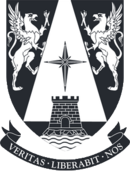

# MIA_DeepLearning 
    
Repositorio creado para el Curso de Deep Learning (Aprendizaje Profundo) en el programa de Magister en Inteligencia Artificial de la Universidad Adolfo Ibáñez.

Profesor: Juan Bekios.

**Eduardo Carrasco Vidal**
 

## Contiene los siguientes Notebooks:

1. [Introducción a Python]
 
